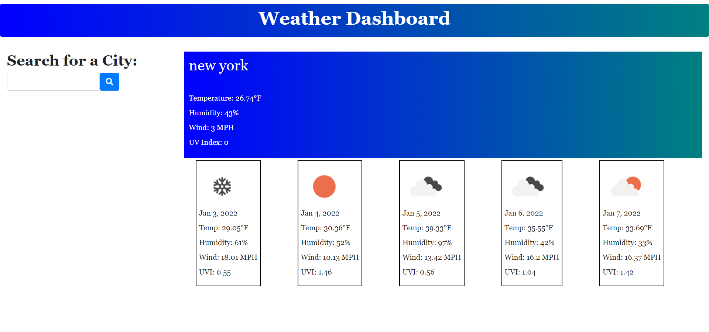

# Weather App 

## Description

This Weather Dashboard is an application in which the user can search for a certain city and with that cities geo-data the Dashboard will display the current weather and a 5 day forecast for that city.

## Table of contents
* [Description](#description)
* [Technologies](#technologies)
* [Screenshot](#screenshot)
* [Credits](#credits)

## Technologies

* JavaScript

* CSS

* HTML

* Bootstrap
 

## Screenshot
<<<<<<< HEAD

=======

>>>>>>> 4cb344976c463dbf94e908bb7a373b8a6c1748f4

## Deployment 

* [Weather Dashboard](https://kasaipreston.github.io/Weather-app/) 
* [GitHub](https://github.com/kasaipreston/Weather-app/settings/pages) 

## Credits
 
API's used : 
  * [Weather and Geo data](https://openweathermap.org/api) 
 

